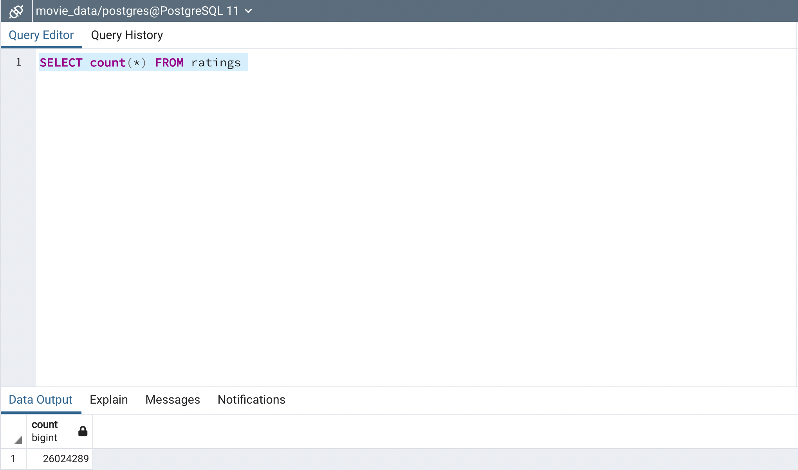
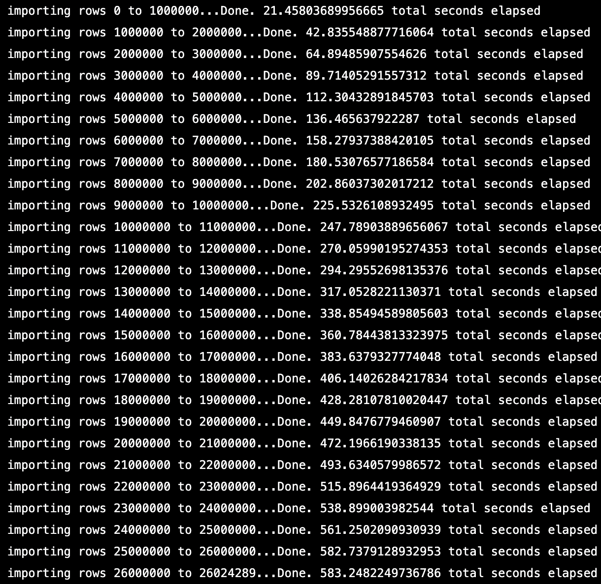
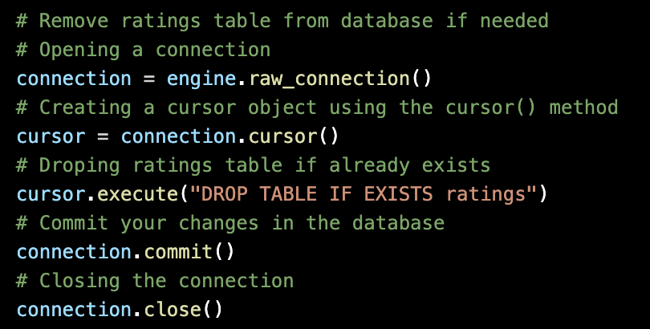

# Movies-ETL

An example of creating a data pipeline using Python, Pandas and PostgreSQL on large data files with the  Extract, Transform, Load (ETL) process.

## Overview
The purpose of this project was to create an automated pipeline that takes in raw data from Wikipedia, MovieLens and The Movie Database, then performs the appropriate transformations and finally loads the data into existing tables connected to a database. 
The data set includes movies from 1990 to 2018.

## Resources
* **Software:** Python 3.7.9, Anaconda 4.9.2, Jupyter Notebooks 6.1.4, PostgreSQL 4.28
* **Libraries:** Pandas, SQLAlchemy, NumPy, json,os, psycopg2, time, re
* Large file storage was required, per github file size requirements. [Using Git LFS](https://git-lfs.github.com/)

## Process

* Create an ETL pipeline using Jupyter Notebooks and PostgreSQL from raw data to SQL database.

### Extract
The pandas and json libraries were used to read data from multiple sources using Python. 
Data sourced from:

* **Wikipedia:** (format: .json, file size: 6.2MB) ~7 thousand movie titles that include information about the movies, budgets, box office returns, cast/crew, production and distribution.

* **Kaggle:** - 2 files (format: .csv)

    * a metadata file from [The Movie Database](https://www.themoviedb.org/) containing movie details with 45.5 thousand entries. (File size: 34.4MB)

    * a dataset from [MovieLens](https://movielens.org/) containing over 26 million movie ratings/review. (File size: 709.6MB)

### Transform
* Clean and structure data using Pandas and regular expressions (RegEx) to achieve desired form. (i.e. using RegEx to parse data and transform text into numbers.

	* Deleting bad data (corrupted or missing), removing duplicate rows, and consolidating columns.
	* Using RegEx to parse data
    * Create a function to transforma text into numbers, across multiple data sets.

    

### Load

* Export transformed data into a database.

## Results

* Using the extract_load_transform() fucntion created, we were able to clean the raw data, merge the datasets and export the data into two new tables in PostgreSQL by using Python. 
* The final results created a movies table with 6,052 rows( 17% reduction from the original of 7,311) and a ratings table with 26,024,289 rows.
* The time Python module was used to display the elapsed time for a new row add in each table

## Challenges

* Using git-lfs to track large csv files over 100MB and github SSH login proved cumbersome.

"During the normal lifetime of a request such as a push, git-lfs will generally need to get credentials a few times - once to actually push content to the remote, as well as some additional API requests to do LFS-specific operations. As such, it's normal for git-lfs to need credentials three times as you're seeing here." [comment from git-lfs contributor Lilah Ingvaldsen](https://github.com/git-lfs/git-lfs/issues/3318#issuecomment-430803103)

* The database creation function required a function to remove the ratings table, if one already existed. During testing, I found that the ratings table creation sequence allowed data to be appended multiple times in the data base. Resolving this issue manually in SQL could be time consuming or messy.

 

## Summary

It was clear why the ETL process of creating a data pipeline is extremely popular when cosuming and evaluating large data sets. 

